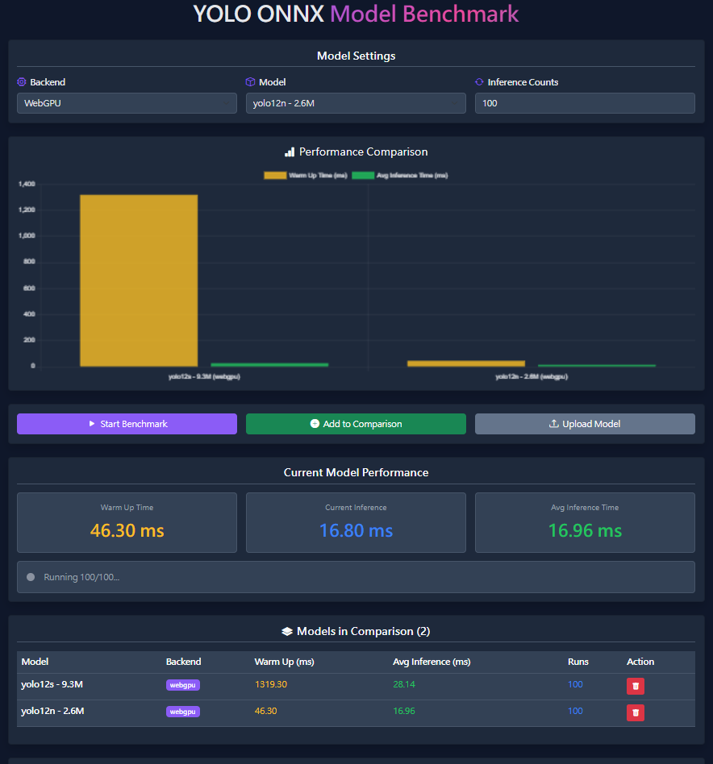

# 🚀 Yolo model Benchmark onnxruntime web



This is yolo model Benchmark, power by onnxruntime web.

Support WebGPU and wasm(cpu).

Test yolo model inference time in web.

Realtime Show inference time and Average in card.

## Features ✨

- ⏱️ Real-time inference benchmarking for YOLO models.
- 🖥️ Support for WebGPU and WASM backends.
- 📈 Interactive charts for performance comparison.
- 📤 Upload and test custom ONNX models.
- 📋 History tracking and exportable results.

## 📊 Available Models

| Model                                                   | Input Size | Params | mAP<sup>val<br>50-95 | Speed<br><sup>T4 TensorRT10<br>(ms) | License                                                                                                  |
| ------------------------------------------------------- | ---------- | ------ | -------------------- | ----------------------------------- | -------------------------------------------------------------------------------------------------------- |
| [YOLO12-S](https://github.com/ultralytics/ultralytics)  | 640        | 9.3M   | 48.0                 | 2.61                                | [AGPL-3.0](./public/models/LICENSE.txt) ([Ultralytics YOLO](https://github.com/ultralytics/ultralytics)) |
| [YOLO12-N](https://github.com/ultralytics/ultralytics)  | 640        | 2.6M   | 40.6                 | 1.64                                | [AGPL-3.0](./public/models/LICENSE.txt) ([Ultralytics YOLO](https://github.com/ultralytics/ultralytics)) |
| [YOLO11-M](https://github.com/ultralytics/ultralytics)  | 640        | 20.1M  | 51.5                 | 4.7 ± 0.1                           | [AGPL-3.0](./public/models/LICENSE.txt) ([Ultralytics YOLO](https://github.com/ultralytics/ultralytics)) |
| [YOLO11-S](https://github.com/ultralytics/ultralytics)  | 640        | 9.4M   | 47.0                 | 2.5 ± 0.0                           | [AGPL-3.0](./public/models/LICENSE.txt) ([Ultralytics YOLO](https://github.com/ultralytics/ultralytics)) |
| [YOLO11-N](https://github.com/ultralytics/ultralytics)  | 640        | 2.6M   | 39.5                 | 1.5 ± 0.0                           | [AGPL-3.0](./public/models/LICENSE.txt) ([Ultralytics YOLO](https://github.com/ultralytics/ultralytics)) |
| [YOLOv10-S](https://github.com/ultralytics/ultralytics) | 640        | 7.2M   | 46.3                 |                                     | [AGPL-3.0](./public/models/LICENSE.txt) ([Ultralytics YOLO](https://github.com/ultralytics/ultralytics)) |
| [YOLOv10-N](https://github.com/ultralytics/ultralytics) | 640        | 2.3M   | 38.5                 |                                     | [AGPL-3.0](./public/models/LICENSE.txt) ([Ultralytics YOLO](https://github.com/ultralytics/ultralytics)) |
| [YOLOv9-S](https://github.com/ultralytics/ultralytics)  | 640        | 7.2M   | 46.8                 |                                     | [AGPL-3.0](./public/models/LICENSE.txt) ([Ultralytics YOLO](https://github.com/ultralytics/ultralytics)) |
| [YOLOv9t-T](https://github.com/ultralytics/ultralytics) | 640        | 2.0M   | 38.3                 |                                     | [AGPL-3.0](./public/models/LICENSE.txt) ([Ultralytics YOLO](https://github.com/ultralytics/ultralytics)) |
| [YOLOv8-S](https://github.com/ultralytics/ultralytics)  | 640        | 11.2M  | 44.9                 |                                     | [AGPL-3.0](./public/models/LICENSE.txt) ([Ultralytics YOLO](https://github.com/ultralytics/ultralytics)) |
| [YOLOv8-N](https://github.com/ultralytics/ultralytics)  | 640        | 3.2M   | 37.3                 |                                     | [AGPL-3.0](./public/models/LICENSE.txt) ([Ultralytics YOLO](https://github.com/ultralytics/ultralytics)) |

## 🛠️ Installation Guide

1. Clone this repository

```bash
git clone https://github.com/nomi30701/yolo-onnx-benchmark-web.git
```

2. cd to the project directory

```bash
cd yolo-onnx-benchmark-web
```

3. Install dependencies

```bash
yarn install
```

## 🚀 Running the Project

Start development server

```bash
yarn dev
```

Build the project

```bash
yarn build
```

## 🔧 Using Custom YOLO Models

To use a custom YOLO model, follow these steps:

### Step 1: Convert your model to ONNX format

Use Ultralytics or your preferred method to export your YOLO model to ONNX format. Ensure to use `opset=12` for WebGPU compatibility.

```python
from ultralytics import YOLO

# Load your model
model = YOLO("path/to/your/model.pt")

# Export to ONNX
model.export(format="onnx", opset=12, dynamic=True)
```

### Step 2: Add the model to the project

- Option 1: Upload via UI 📤
  Click the "Upload Model" button in the app and select your .onnx file.

- Option 2: Place in Directory 📁
  Copy your ONNX file to ./public/models/. Then, update App.jsx to include it in the model selector:

```jsx
<option value="your-custom-model-name">Your Custom Model</option>
```

### Step 3: Run Benchmark 🎯

Refresh the page, select your model, and start benchmarking.

> 🚀 WebGPU Support
>
> Ensure you set `opset=12` when exporting ONNX models, as this is required for WebGPU compatibility.
